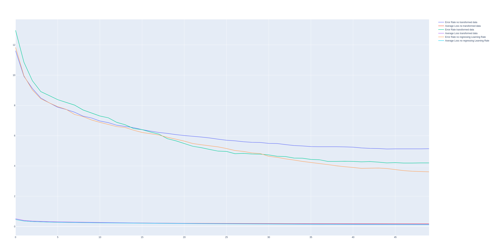

# MNIST project

This project has the objective of testing a wide range of Neural networks and
Machin Learning models. To test these models, the MNIST dataset will be used.

Technologies: 
 - Python
 - Pytorch

## A. Neural Networks

Here, a list of neural networks from the site [HackerRank - 10 Type of Neural Networks](https://www.hackerrank.com/blog/types-of-neural-networks-explained/)

### 1. Feed forward Neural Networks
#### 1.1. Description: 
Most basic type of neural network. Consists of : 
 - Input layer
 - Hidden layers
 - Output layers
 
This means that the data flows in a forward maner. This type of Neural Networks is very 
used in a variaty of different projects (Image & speach recognition, Natural Language
Processing and predictive modeling).

#### 1.2. Applicative case:
Here as an image is a 2D array, the Neural Network need to have a Flatten layer as an input.
This makes the 2D array in input, transform into a 1D array. Looking at the source page for the
[MNIST dataset by Yann Lecun](https://yann.lecun.com/exdb/mnist/), the stucture of the Feed
Forward Neural Network doesn't impact the accuracy as mutch. 

The most accurate Neural Networks
are the ones with an elastique distortion as a way of augmenting the dataset as described by the paper:
[Deep Big Simple Neural Nets Excel on Handwritten Digit Recongnition (Dan Ciresan - arXiv:1003.0358\[cs.NE\])](http://arxiv.org/abs/1003.0358)
where they scored an error rate of 0.35%.

In this part, the aim is not to get the same error rate as the paper cited above, but to test the importance of data augmentation. As the paper have done, the weights are also initialized following a normalization [-0.05; 0.05].

#### 1.3 Testing:

The code for the Neural Network can be found in [`./src/feed_forward_neral_net.py`](src/feed_forward_neural_net.py). It is the same structure as cited in the paper : 2500, 2000, 1500, 1000, 500, 10 neurons for each consecutive layer.
3 Test where done: 

- A control test with no modification and no learning rate change
- A test regarding the learning rate change (from 1e-3 to 1e-6)
- A test regarding the dataset transformation with learning rate change

Regarding the data transformation, the following transformation is applyed : 
- RandomRotation (7)
- RandomResizedCrop(28, scale=(0.89, 1.0), ratio=(0.89, 1.11))
- ElasticTransformation(alpha=37.0, sigma=5.5)

Here are the results: 

As we can see, the best result was the control test, but the risk for this model is the overfitting of the model. The second best test is the data transformation. The last best test is the degrading learning.

As the paper said the Data Transformation in each epoch is the best aproch for this type of model even if the no learning rate change is better it might be over fitting in the long run.

### 2. Perceptron

### 3. Multilayer Perceptron

### 4. Recurrent Neural Networks (RNN)

### 5. Long Short-Term Memory (LSTM)

### 6. Radial Basis Functional Neural Network (RBF)

### 7. Convolutional Neural Networks (CNN)

### 8. Autoencoder Neural Networks

### 9. Sequence to Sequence Models (Seq2Seq)

### 10. Modular Neural Network (MNN)

## B. Machine Learning

## C. Conclusion

